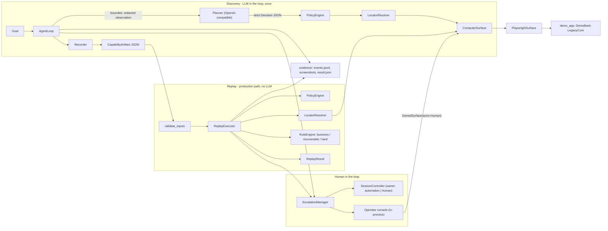

# Computer-Use Automation System

An LLM discovers how to accomplish a goal in a legacy banking back-office application. The
successful run becomes a **typed, versioned capability artifact**. That artifact is then
**replayed deterministically — with no model in the loop** — returning typed outputs, a
business outcome, or a structured failure, with evidence, policy guardrails, and a real
same-session human handoff when automation cannot safely continue.

```
Goal ──▶ LLM discovery ──▶ CapabilityArtifact (JSON) ──▶ Deterministic replay ──▶ ReplayResult
            (once)             reviewable contract          (every time, no LLM)     outputs | outcome | failure
                                                                   │
                                                          stuck / irreversible?
                                                                   ▼
                                                    Operator console: same browser session
                                                    pause ▸ take control ▸ act ▸ release ▸ resume
```

Design write-up: [REPORT.md](REPORT.md). Evidence of real runs: [evidence/](evidence/).

## Architecture



- **The model picks *which* control; the system computes *how* to find it.** The LLM refers to observed controls by ref; the recorder derives multi-strategy targets from the real DOM node and verifies each strategy is unique before persisting it.
- **Every checkpoint was observed true during discovery.** Pre/postconditions come from the pages actually seen; nothing is assumed to have worked because Playwright did not throw.
- **One rule engine for runtime states** (business outcomes, known dialogs, fatal states), curated per vendor product in [profiles/](profiles/) and embedded in each artifact.
- **Ownership is enforced in code.** Exactly one actor may act on the live page; the operator console runs inside the run's process and drives the *same* page.

## Technology choices

| Choice | Why |
| --- | --- |
| Python 3.11, asyncio, one process | The operator must act on the same browser page automation paused on; a single event loop makes that trivial and honest. |
| Playwright (async) | Real browser, accessibility-role queries for legacy markup, screenshots with masking. Only `app/automation/browser.py` knows about it. |
| Pydantic v2 | Strict (`extra="forbid"`) schemas for the artifact, the LLM decision and the result contract; malformed artifacts and model output fail loudly. |
| FastAPI + Jinja2 | The synthetic legacy app and the operator console; server-rendered, small. |
| OpenAI-compatible chat completions | Any provider behind `LLM_BASE_URL`; JSON mode plus Pydantic validation with bounded retries. Used **only** by `discover`. |
| JSON files | Artifacts and evidence are files you can read, diff and review. No database, queue or cloud service. |

## Setup

Requirements: Python 3.11+, [uv](https://docs.astral.sh/uv/), `make`. (Docker alternative below.)

```bash
make setup            # uv sync (pinned via uv.lock), install Chromium, create .env from .env.example
```

Then put your model credentials in `.env` (never committed):

```bash
LLM_API_KEY=sk-...                      # required only for `discover`
LLM_MODEL=gpt-4.1                       # any chat-completions model
LLM_BASE_URL=https://api.openai.com/v1  # any OpenAI-compatible endpoint
```

### Environment variables

| Variable | Default | Purpose |
| --- | --- | --- |
| `LLM_API_KEY`, `LLM_MODEL`, `LLM_BASE_URL`, `LLM_TIMEOUT_S` | — / `gpt-4.1` / OpenAI / 90 | Discovery only. Replay never reads them. |
| `DEMO_APP_URL`, `DEMO_APP_PORT` | `http://localhost:8000`, `8000` | Where the synthetic app runs. |
| `DEMO_OPERATOR_ID`, `DEMO_ACCESS_CODE` | `teller1`, `teller-pass` | Synthetic read-only operator (fake credentials for the local app). |
| `DEMO_SUPERVISOR_ID`, `DEMO_SUPERVISOR_CODE` | `super1`, `super-pass` | Synthetic supervisor; may open sub-accounts. |
| `HEADLESS` | `true` | `false` shows the browser; a human may then also act directly in the window during a handoff. |
| `OPERATOR_PORT` | `8001` | Operator console port. |
| `ESCALATION_TIMEOUT_S` | `900` | How long a run waits for a human. |
| `AGENT_MAX_STEPS`, `AGENT_MAX_RUNTIME_S`, `OBS_MAX_*`, `REPLAY_*` | see `app/config.py` | Hard limits and observation bounds. |

## 1. Start the demo application

```bash
make demo             # http://localhost:8000  (Ctrl+C to stop; keep it running in this terminal)
```

"DemoBank LegacyCore Teller Workstation": server-rendered, table layouts, no test IDs, mixed
label association, confirmation pages, role-based permissions, and a fault-injection console at
`/__admin` (denied to the agent by policy). All data is synthetic: member `12345` "Demo Member",
checking `$1,250.50`, savings `$8,432.17`.

## 2. Run a genuine LLM discovery

In a second terminal:

```bash
make discover
# = python -m app.cli discover \
#     --goal "Look up member 12345 and read their current savings balance" \
#     --url http://localhost:8000/login --name member_savings_lookup \
#     --input member_id=12345 --input operator_id=teller1 \
#     --input access_code=env:DEMO_ACCESS_CODE --sensitive access_code
```

The model observes the live page, decides one action at a time (`click`, `type`, `select`,
`press`, `navigate`, `extract`, `finish`, `escalate`) as strict JSON, and every action is
policy-checked before execution. Secrets are only ever shown to the model as `${access_code}`.

Output:

- **Artifact**: `artifacts/member_savings_lookup.v1.json`
- **Evidence**: `evidence/discovery/<run-id>/` — `events.jsonl` (with `LLM_DECISION` events),
  `llm-call-NN.json` (redacted prompt and raw response per step), `step-NN-*.png` screenshots,
  `artifact.json`, `result.json`.

If the console is attached (default) and the model gets stuck or hits an irreversible action, the
run pauses and prints the operator console URL (see step 5).

## 3. Replay deterministically (no LLM)

```bash
make replay
# = python -m app.cli replay --artifact artifacts/member_savings_lookup.v1.json \
#     --input member_id=12345 --input operator_id=teller1 --input access_code=env:DEMO_ACCESS_CODE \
#     --escalation none
```

```
SUCCESS
  outputs:
    status: 'success'
    member_id: '12345'
    savings_balance: Decimal('8432.17')
    message: None
  steps: 8/8  recoveries: 0  interventions: 0  llm_calls: 0  duration: 0.5s
  evidence: evidence/replay/replay-...
```

Every step: wait for preconditions → policy → resolve target (semantic strategies first) → act →
wait for postconditions → evidence. `llm_calls` is always `0`; the event log contains no `LLM_*`
events (asserted by tests). Different inputs, same artifact: `--input member_id=23456` returns
`15000.00`.

## 4. Business outcomes vs. failures

```bash
make replay-not-found        # member 99999
```
```
BUSINESS_OUTCOME
  business_outcome / MEMBER_NOT_FOUND: No member found matching member number 99999.
  outputs: status='not_found', member_id='99999', savings_balance=None, message='No member found ...'
```

```bash
make replay-invalid          # member_id=abc -> HARD_FAILURE / INVALID_INPUT, before any browser action
make replay-transient        # one injected core outage -> recovered, SUCCESS (recoveries: 1)
make replay-fail-checkpoint  # injected application error -> HARD_FAILURE / UNEXPECTED_STATE + screenshot
make replay-fail-ambiguous   # duplicate search form -> ESCALATED / AMBIGUOUS_TARGET (no operator attached)
```

Other runtime conditions handled by the profile rules: `INSUFFICIENT_PERMISSION` and
`VALIDATION_REJECTED` (business outcomes), `KNOWN_DIALOG` / `SESSION_REFRESH_REQUIRED` (dismissed
and continued), `SESSION_LOST` / `AUTHENTICATION_FAILED` (hard). Inject any of them with
`python -m app.cli demo inject --flag <name>=<value>`; see `/__admin` for the list.

## 5. Human escalation and same-session handoff

```bash
make demo-escalation         # injects a duplicate form, replays with the operator console attached
```

The run pauses at the ambiguous step, prints `HUMAN INTERVENTION NEEDED ... console=http://127.0.0.1:8001/interventions/int-001`
and waits. Open that URL: you see the reason, the live screenshot (refreshing), the session
state and owner, and the controls on the page. Either:

- **Take control** → perform actions on the *same* browser page (pick a ref, e.g. type `12345`
  into the main "Member Number" field and click its "Search") → **Release**. Automation
  re-verifies the page, notices you completed the search, resumes at the extraction step and
  finishes with `SUCCESS`, recording `human_completed_steps` and every human action.
- **Abort** → the run ends `ESCALATED / ABORTED_BY_OPERATOR`.

The same works from a terminal:

```bash
python -m app.cli operator list
python -m app.cli operator take-control int-001        # lists controls with refs
python -m app.cli operator act int-001 --action type --ref c5 --value 12345
python -m app.cli operator act int-001 --action click --ref c6
python -m app.cli operator release int-001 --note "used the main form"
```

Irreversible actions go through the same channel as an **approval**:

```bash
make demo-approval           # sub-account flow (supervisor); pauses before "Confirm and Open Account"
python -m app.cli operator approve int-001
```

With `HEADLESS=false` you can also click directly in the visible browser window while you hold
control; those clicks are recorded too (password values masked).

## 6. Tests

```bash
make test               # 118 tests: unit + browser integration + scripted end-to-end (no network)
make test-unit          # fast, no browser
make test-live          # genuine LLM discovery test (needs LLM_API_KEY)
make lint               # ruff + mypy --strict
```

The scripted end-to-end tests drive the discovery loop with a deterministic stand-in for the
model (`tests/fakes/scripted_planner.py`) that receives exactly the rendered observation the
real model receives. The real provider path is `app/agent/planner.py`, exercised by
`make discover` and `make test-live`.

## Docker (alternative to a local Python setup)

```bash
docker compose up -d demo-app
docker compose run --rm cli replay --artifact artifacts/member_savings_lookup.v1.json \
  --input member_id=12345 --input operator_id=teller1 --input access_code=env:DEMO_ACCESS_CODE \
  --base-url http://demo-app:8000 --escalation none
```

`--base-url` runs the recorded artifact against a different host — the simplest tenant override.

## Project structure

```
app/
  agent/          discovery: models.py (Decision), prompts.py, planner.py (LLM client),
                  observation.py, recorder.py, loop.py
  artifacts/      schema.py (CapabilityArtifact), params.py, serializer.py, validator.py, profile.py
  automation/     surface.py (ComputerSurface), browser.py (Playwright), locators.py (resolver),
                  actions.py, waits.py, dom_snapshot.js, table_cell.js
  replay/         executor.py, checkpoints.py, rules.py, errors.py (taxonomy, ReplayResult)
  safety/         policy.py, redaction.py
  escalation/     session.py (ownership state machine), manager.py, human_recorder.py
  api/            operator.py (console) + templates
  observability/  events.py, evidence.py, logging.py
  orchestration.py, runtime.py, config.py, cli.py
demo_app/         synthetic LegacyCore application (FastAPI + Jinja2) with fault injection
policies/         demobank.json    — allowlist, action list, risk rules
profiles/         demobank_legacycore.json — runtime-condition rules per vendor product
artifacts/        recorded capabilities
evidence/         discovery/, replay/, failure/ runs
tests/            unit/, integration/, e2e/, fakes/, fixtures/
```

## Security considerations

- No secrets in the repo: `.env` is git-ignored; `.env.example` holds placeholders and the
  synthetic demo credentials of the local app.
- Sensitive inputs are accepted only as `env:VAR`; the model sees `${access_code}`; a policy rule
  refuses to type a secret into an unmasked field; screenshots mask password fields.
- A single redactor scrubs secret values, secret-like keys and PII patterns (account/card
  numbers, SSNs, emails, phones) from events, evidence text, intervention records and the
  observation sent to the model.
- The policy engine runs before every action in discovery and replay; the model can raise but
  never lower a risk classification; navigation is limited to the allowlist and `/__admin` is denied.
- Irreversible steps require a human approval and are never retried automatically.
- Artifact and evidence filenames are validated against traversal; malformed artifacts are
  rejected with a schema error before any browser action.

## Known limitations

- One concrete surface (Chromium via Playwright). Frames are reserved in the schema and rejected
  explicitly by the resolver; desktop surfaces are designed for, not implemented.
- Tenant overrides are a documented model with hooks (`base_url`, `fallbacks`,
  `compatibility`), not a loader.
- The operator console is bound to one run in one process and has no authentication (localhost).
- PII redaction is pattern-based; names in page text are not detected. Screenshots contain page
  content and must be treated as regulated evidence in production.
- The demo app is synthetic; its runtime-condition rules are curated by hand, as they would be
  per vendor product in production.
